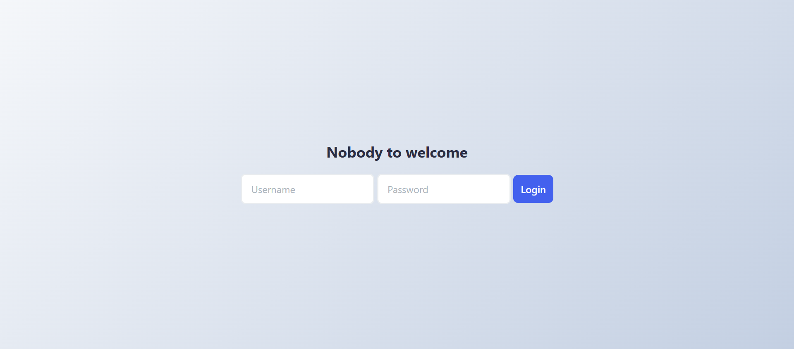

# Simple Login System with LocalStorage

## What it does

- Users can type username and password
- Click "Login" to save 
- Shows welcome message with username
- Click "Logout" to forget the user

## Files

- localstorage.html - Main page with form
- localstorage.css - Styles for the page
- localstorage.js - Makes login work

## How to use

1. Open localstorage.html in browser
2. Type any username and password
3. Click Login button
4. Click Logout to forget
